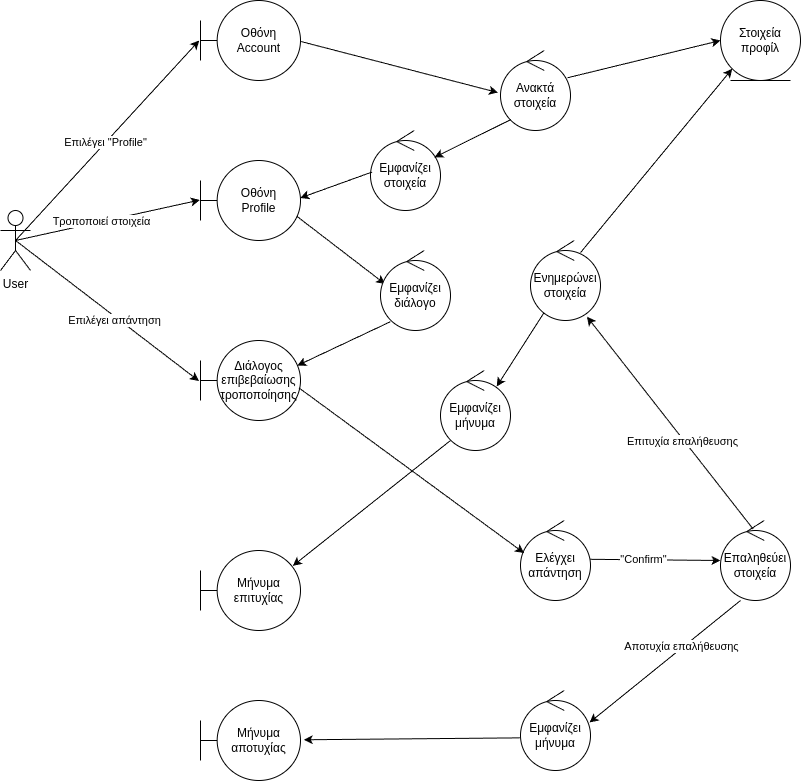
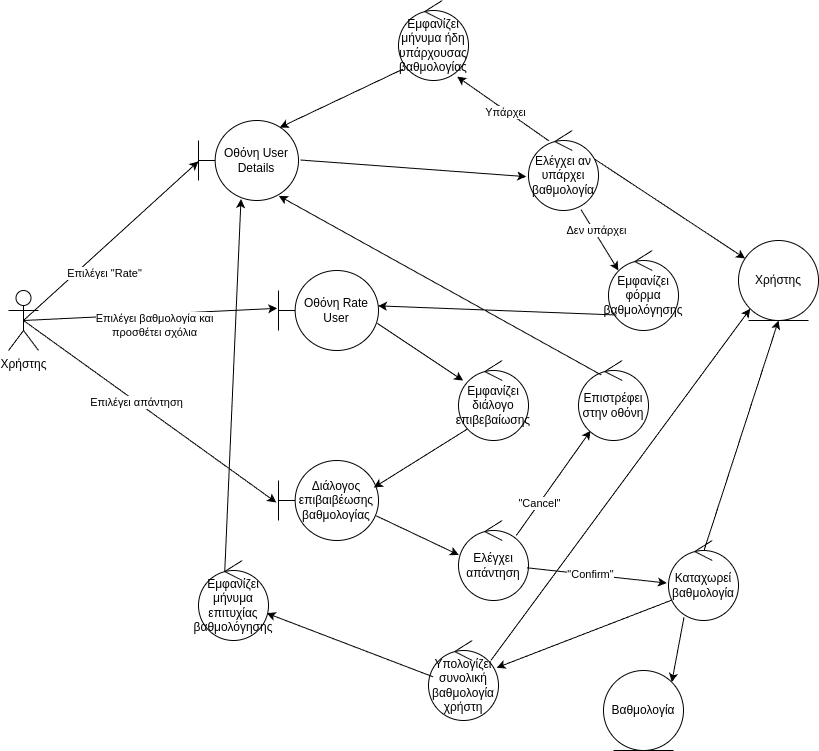
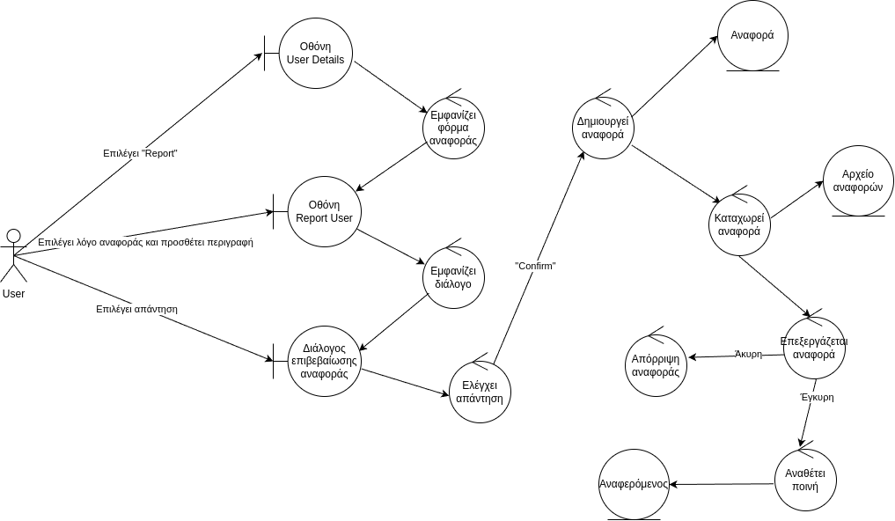
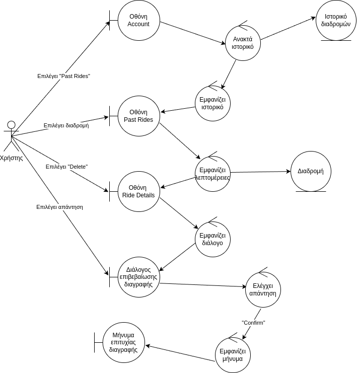

## Edit Profile

### Περιγραφή

Ο χρήστης επιθυμεί να ενημερώσει τα στοιχεία του προφίλ του.

#### Βασική Ροή

1. Ο χρήστης επιλέγει "Profile" στην οθόνη Account.
2. Το σύστημα ανακτά τα στοιχεία προφίλ του χρήστη και τα εμφανίζει στην οθόνη Profile.
3. Ο χρήστης τροποποιεί κάποια στοιχεία στην οθόνη Profile.
4. Το σύστημα εμφανίζει τον διάλογο επιβεβαίωσης τροποποίησης.
5. Ο χρήστης επιλέγει "Confirm" στον διάλογο επιβεβαίωσης τροποποίησης.
6. Το σύστημα ελέγχει την απάντηση του χρήστη.
7. Το σύστημα επαληθεύει τα στοιχεία.
8. To σύστημα ενημερώνει τα στοιχεία προφίλ του χρήστη.
9. Το σύστημα εμφανίζει μήνυμα επιτυχίας στην οθόνη Account.

#### Εναλλακτική Ροή: Ακύρωση

5. Ο χρήστης επιλέγει "Cancel" στον διάλογο επιβεβαίωσης τροποποίησης.
6. Το σύστημα ελέγχει την απάντηση του χρήστη.
7. Τo σύστημα επιστρέφει στην οθόνη Account.

#### Εναλλακτική Ροή: Αποτυχία Επαλήθευσης

7. Το σύστημα αποτυγχάνει να επαληθεύσει τα στοιχεία.
8. Το σύστημα εμφανίζει μήνυμα αποτυχίας στην οθόνη Profile.

### Ανάλυση Ευρωστίας

## Rate User

### Περιγραφή

Ο χρήστης επιθυμεί να βαθμολογήσει έναν άλλο χρήστη.

#### Βασική Ροή

1.  Ο χρήστης επιλέγει "Rate" στην οθόνη User Details.
2.  Το σύστημα ελέγχει αν υπάρχει ήδη βαθμολογία στο προφίλ του βαθμολογούμενου.
3.  Η εφαρμογή εμφανίζει την φόρμα βαθμολόγησης στην οθόνη Rate User.
4.  Ο χρήστης επιλέγει την βαθμολογία που θεωρεί και προσθέτει σχόλια στην οθόνη Rate User.
5.  Το σύστημα εμφανίζει τον διάλογο επιβεβαίωσης βαθμολογίας.
6.  Ο χρήστης επιλέγει "Confirm" στον διάλογο επιβεβαίωσης.
7.  Το σύστημα καταχωρεί την βαθμολογία στο προφίλ του βαθμολογούμενου.
8.  Το σύστημα υπολογίζει τη νέα συνολική βαθμολογία του βαθμολογούμενου.
9.  Το σύστημα εμφανίζει μήνυμα επιτυχίας στην οθόνη User Details.

#### Εναλλακτική Ροή: Ο χρήστης έχει δώσει βαθμολογία

3. H εφαρμογή εμφανίζει μήνυμα ήδη υπάρχουσας βαθμολογίας στην οθόνη User Details.

#### Εναλλακτική Ροή: Ακύρωση

6.  Ο χρήστης επιλέγει "Cancel" στον διάλογο επιβεβαίωσης.
7.  Το σύστημα επιστρέφει στην οθόνη User Details.

### Ανάλυση Ευρωστίας

## Report User

### Περιγραφή

Ο χρήστης επιθυμεί να αναφέρει έναν άλλο χρήστη της εφαρμογής για παράνομη ή ανεπιθύμητη δραστηριότητα.

#### Βασική Ροή

1. Ο χρήστης επιλέγει "Report" στην οθόνη User Details.
2. Το σύστημα εμφανίζει την φόρμα αναφοράς στην οθόνη Report User.
3. Ο χρήστης επιλέγει τον λόγο αναφοράς και προσθέτει σχόλια στην οθόνη Report User.
4. Το σύστημα εμφανίζει τον διάλογο επιβεβαίωσης αναφοράς.
5. Ο χρήστης επιλέγει "Confirm" στον διάλογο επιβεβαίωσης αναφοράς.
6. Το σύστημα δημιουργεί την αναφορά.
7. Το σύστημα καταχωρεί την αναφορά στο αρχείο.
8. Το σύστημα επεξεργάζεται την αναφορά.
9. Το σύστημα αναθέτει ποινή στον αναφερόμενο.
10. Το σύστημα εμφανίζει μήνυμα επιτυχίας στην οθόνη User Details.

#### Εναλλακτική Ροή: Απόρριψη Αναφοράς

9. Το σύστημα απορρίπτει την αναφορά.
10. Το σύστημα εμφανίζει μήνυμα επιτυχίας.
11. Επιστροφή στην οθόνη User Details.

#### Εναλλακτική Ροή: Ακύρωση

5. Ο χρήστης επιλέγει "Cancel" στον διάλογο επιβεβαίωσης αναφοράς.
6. Το σύστημα επιστρέφει στην οθόνη Report User.

### Ανάλυση Ευρωστίας

## View Past Rides

### Περιγραφή

Ο χρήστης επιθυμεί να δει το ιστορικό διαδρομών του.

#### Βασική ροή

1. Ο χρήστης επιλέγει "Past Rides" στην οθόνη Account.
2. Το σύστημα ανακτά το ιστορικό διαδρομών και το εμφανίζει στην οθόνη Past Rides.
3. Ο χρήστης επιλέγει μία διαδρομή στην οθόνη Past Rides.
4. Το σύστημα εμφανίζει τις λεπτομέρειες της διαδρομής στην οθόνη Ride Details.

#### Εναλλακτική Ροή: Διαγραφή διαδρομής από το ιστορικό

5. Ο χρήστης επιλέγει "Delete" στην οθόνη Ride History.
6. Το σύστημα εμφανίζει τoν διάλογο επιβεβαίωσης διαγραφής.
7. Ο χρήστης επιλέγει "Confirm" στον διάλογο επιβεβαίωσης διαγραφής.
8. Το σύστημα διαγράφει τη διαδρομή από το ιστορικό.
9. Το σύστημα εμφανίζει μήνυμα επιτυχίας στην οθόνη Past Rides.

#### Εναλλακτική Ροή: Ακύρωση Διαγραφής

5. Ο χρήστης επιλέγει "Delete" στην οθόνη Ride History.
6. Το σύστημα εμφανίζει τoν διάλογο επιβεβαίωσης διαγραφής.
7. Ο χρήστης επιλέγει "Cancel" στον διάλογο επιβεβαίωσης διαγραφής.
8. Το σύστημα επιστρέφει στην οθόνη Past Rides.

### Ανάλυση Ευρωστίας

