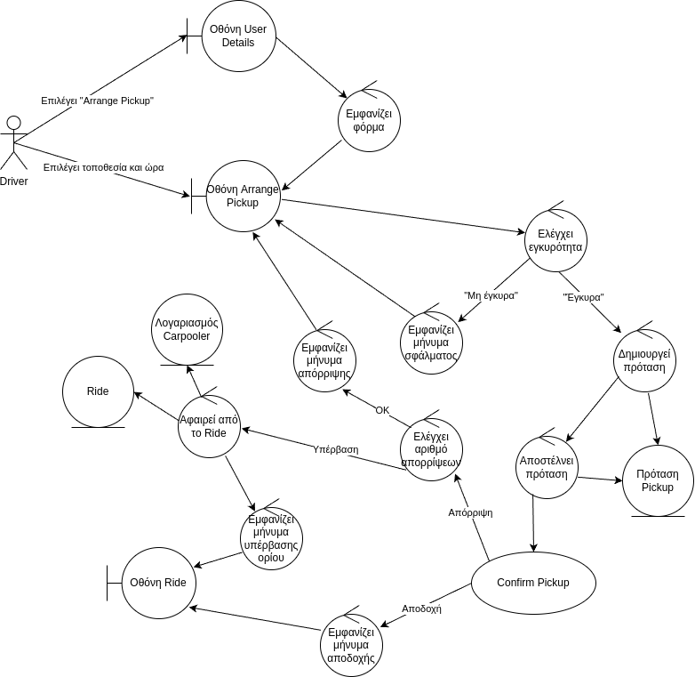

## Arrange Pickup

### Περιγραφή

Ο οδηγός διευθετεί συγκεκριμένα το πότε κι το πού θα γίνει ένα Pickup.

#### Βασική Ροή

1. Ο οδηγός επιλέγει "Arrange Pickup" στην οθόνη User Details.
2. Το σύστημα εμφανίζει τη φόρμα επιλογής τόπου και χρόνου για το Pickup στην οθόνη Arrange Pickup.
3. Ο οδηγός επιλέγει τοποθεσία και ώρα για το Pickup στην οθόνη Arrange Pickup.
4. Το σύστημα ελέγχει αν η τοποθεσία και η ώρα είναι έγκυρες.
5. Το σύστημα δημιουργεί την πρόταση Pickup.
6. Το σύστημα αποστέλλει την πρόταση στον Carpooler.
7. Καλείται η περίπτωση χρήσης "Accept Pickup".
8. Το σύστημα εμφανίζει μήνυμα αποδοχής στην οθόνη Ride.

#### Εναλλακτική Ροή: Μη έγκυρη τοποθεσία/ώρα

5. Το σύστημα εμφανίζει μήνυμα σφάλματος στην οθόνη Arrange Pickup.
6. Συνέχεια από το βήμα 3 της βασικής ροής.

#### Εναλλακτική Ροή: Απόρριψη Pickup

9. Το σύστημα ελέγχει τον αριθμό απορρίψεων.
10. Το σύστημα εμφανίζει μήνυμα απόρριψης στην οθόνη Arrange Pickup.
11. Συνέχεια από το βήμα 3 της βασικής ροής.

#### Εναλλακτική Ροή: Υπέρβαση ορίου απορρίψεων

9. Το σύστημα ελέγχει τον αριθμό απορρίψεων.
10. Το σύστημα αφαιρεί τον λογαριασμό του Carpooler από το Ride.
11. Το σύστημα εμφανίζει μήνυμα υπέρβασης ορίου απορρίψεων στην οθόνη Ride.

### Ανάλυση Ευρωστίας

