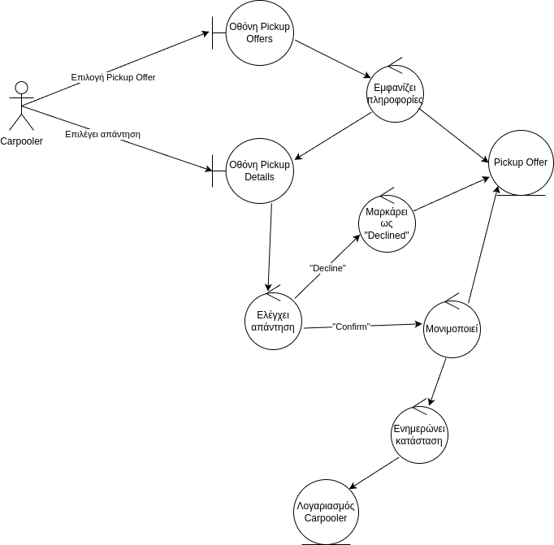

## Confirm Pickup

### Περιγραφή

Ο Carpooler επιβεβαιώνει την πρόταση Pickup που έχει λάβει από τον οδηγό.

#### Βασική Ροή

1. Ο Carpooler επιλέγει την πρόταση Pickup στην οθόνη Pickup Offers.
2. Το σύστημα εμφανίζει τις πληροφορίες της πρότασης Pickup στην οθόνη Pickup Details.
3. Ο Carpooler επιλέγει απάντηση στην οθόνη Pickup Details.
4. Το σύστημα ελέγχει την απάντηση του Carpooler
5. Το σύστημα μονιμοποιεί το Pickup ως μέρος του Ride.
6. Το σύστημα ενημερώνει την κατάσταση του Carpooler.

#### Εναλλακτική Ροή: Απόρριψη Πρότασης Pickup

5. Το σύστημα μαρκάρει το Pickup Offer ως "Declined".

### Ανάλυση Ευρωστίας

