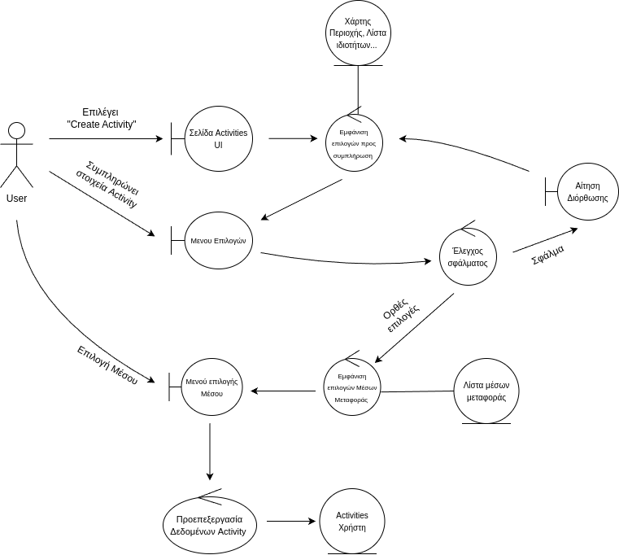

## Create Activity

### Περιγραφή

#### Βασική Ροή

1. Ο χρήστης επιλέγει "Create Activity".
2. Η εφαρμογή εμφανίζει μενού με επιλογές για την ιδιότητα του χρήστη (π.χ. φοιτητής), την περιοχή και τις ώρες μετακίνησης.
3. Η εφαρμογή εμφανίζει τη φόρμα αναζήτησης και έναν χάρτη της περιοχής του χρήστη.
4. Ο χρήστης επιλέγει την ιδιότητά του.
5. Ο χρήστης δηλώνει την περιοχή στην οποία επιθυμεί να μετακινηθεί.
6. Η εφαρμογή εμφανίζει μενού με επιλογές για τις μέρες και τις ώρες έναρξης και λήξης της δραστηριότητας.
7. Ο χρήστης εισάγει τα κατάλληλα στοιχεία.
8. Η εφαρμογή εμφανίζει μενού με επιλογές για το μέσο μεταφοράς του χρήστη.
9. Ο χρήστης επιλέγει το μέσο μεταφοράς του.
10. Το σύστημα εκτελεί προεπεξεργασία στα δεδομένα.
11. Το σύστημα εισάγει τη δραστηριότητα στον κατάλογο δραστηριοτήτων του χρήστη.

#### Εναλλακτική Ροή: Μη έγκυρα στοιχεία

1. Ο χρήστης εισάγει μη έγκυρα στοιχεία.
2. Το σύστημα εμφανίζει μήνυμα σφάλματος και ζητά διόρθωση.
3. Ο χρήστης διορθώνει τα στοιχεία.
4. Συνέχεια από το βήμα 8 της βασικής ροής.

### Ανάλυση Ευρωστίας

