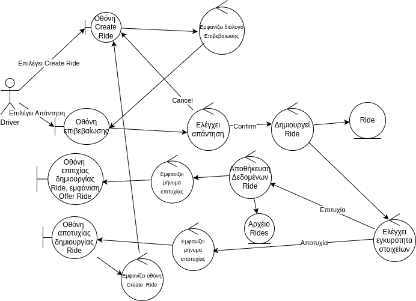

### Περιγραφή

Ο Driver επιθυμεί να δημιουργήσει ένα Ride.

#### Βασική ροή

1. Ο Driver επιλέγει "Create Ride"
2. Το σύστημα εμφανίζει την οθόνη Create Ride
3. Το σύστημα εμφανίζει μια φόρμα με στοιχεία για το Ride που επιθυμεί.
4. Ο Driver συμπληρώνει τα στοιχεία και επιλέγει "Confirm"
5. Το σύστημα ελέγχει την εγκυρότητα των στοιχείων.
6. To σύστημα δημιουργεί το Ride και το καταχωρεί.
7. Το συστημα εμφανίζει μήνυμα επιτυχίας στην οθόνη Ride.

#### Εναλλακτική Ροή: Ακύρωση Ride

4. Ο Driver επιλέγει "Cancel"
5. Επιστροφή στην οθόνη Home

#### Εναλλακτική Ροή: Μη έγκυρα στοιχεία

6. Το συστημα εμφανίζει μήνυμα αποτυχίας στην οθόνη Create Ride
7. Ο Driver διορθώνει τα στοιχεία και επιλέγει "Confirm".
8. Συνέχεια από το βήμα 6 της βασικής ροής.

### Ανάλυση Ευρωστίας

