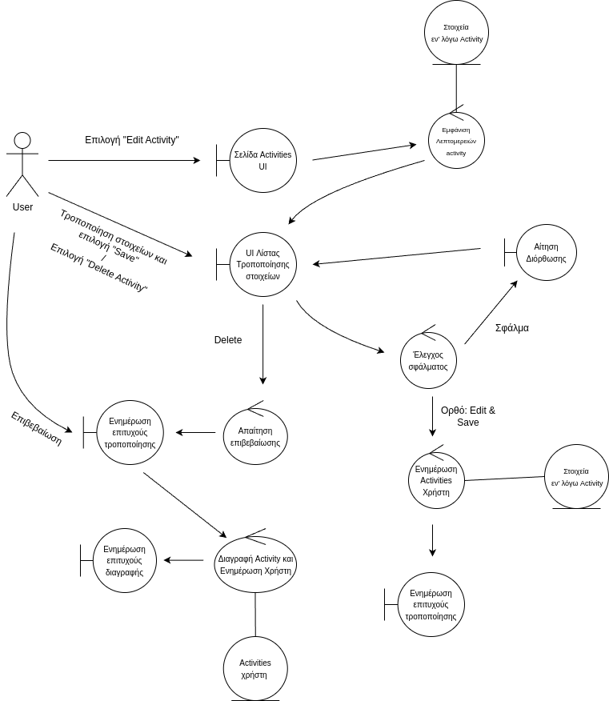

## Edit Activity

## Περιγραφή

#### Βασική Ροή

1. Η εφαρμογή εμφανίζει τις λεπτομέρειες της δραστηριότητας.
2. Ο χρήστης τροποποιεί τη δραστηριότητα.
3. Ο χρήστης επιλέγει "Save".
4. Το σύστημα ενημερώνει την δραστηριότητα.
5. Η εφαρμογή εμφανίζει μήνυμα επιτυχίας.

#### Εναλλακτική Ροή: Μη έγκυρα στοιχεία

1. Ο χρήστης εισάγει μη έγκυρα στοιχεία.
2. Το σύστημα εμφανίζει μήνυμα σφάλματος και ζητά διόρθωση.
3. Ο χρήστης διορθώνει τα στοιχεία.
4. Συνέχεια από το βήμα 3 της βασικής ροής.

#### Εναλλακτική Ροή: Delete Activity

1. Ο χρήστης επιλέγει "Delete Activity".
2. Το σύστημα ζητά επιβεβαίωση.
3. Ο χρήστης επιβεβαιώνει τη διαγραφή.
4. Το σύστημα διαγράφει την δραστηριότητα από το κατάλογο δραστηριοτήτων του χρήστη.
5. Το σύστημα εμφανίζει μήνυμα επιτυχίας.

### Ανάλυση Ευρωστίας

