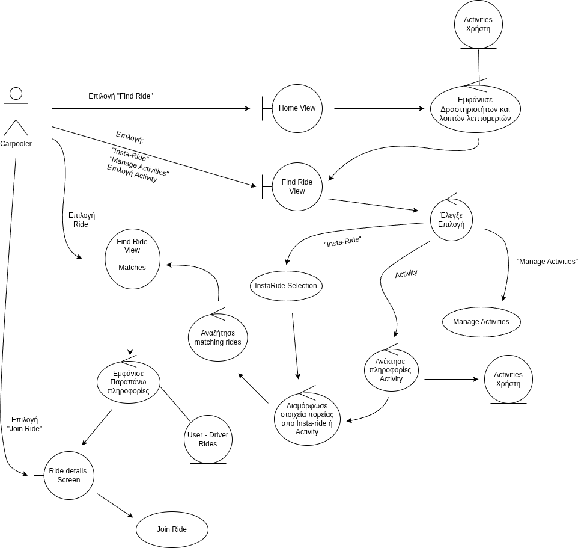

## Find Ride

### Περιγραφή

Ο χρήστης επιθυμεί να βρεί matching rides για να εξυπηρετήσει κάποιο Activity ή Insta-Ride αίτησή του.

#### Βασική Ροή

1. Ο Carpooler επιλέγει "Find Ride" στην οθόνη Home.
2. Το σύστημα ανακτά τα στοιχεία Activity του χρήστη και τα εμφανίζει στην οθόνη Find Ride.
3. Ο χρήστης επιλέγει μεταξύ διαφόρων επιλογών την επιλογή "Insta Ride".
4. Συνέχεια απο Βήμα 1. του UC Insta Ride Selection.
5. Το σύστημα διαμορφώνει τα στοιχεία της αίτησης μετακίνησης.
6. Το σύστημα αναζητά Rides που εξυπηρετούν την αίτηση του χρήστη.
7. Το σύστημα εμφανίζει τα Matching Rides σε συνοπτική μορφη.
8. Ο χρήστης επιλέγει κάποιο Ride.
9. Το σύστημα εμφανίζει περεταίρω λεπτομέριες και επιτρέπει την επιλογή Join Ride.
10. Ο χρήστης επιλέγει Join Ride.
11. Συνέχεια απο το Βήμα 1. του UC Join Ride.

#### Εναλλακτική Ροή: Επιλογή Activity

3. Ο χρήστης επιλέγει μεταξύ διαφόρων επιλογών κάποιο απο τα αναδεικνυόμενα Activities.
4. Συνέχεια απο Βήμα 5.

#### Εναλλακτική Ροή: Επιλογή Manage Activities

3. Ο χρήστης επιλέγει μεταξύ διαφόρων επιλογών την επιλογή "Manage Activities".
4. Συνέχεια απο Βήμα 1. του UC Manage Activities.

### Ανάλυση Ευρωστίας

