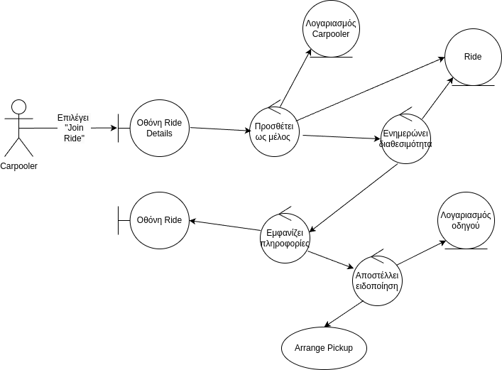

## Join Ride

### Περιγραφή

Ο Carpooler επιθυμεί να συμμετέχει σε κάποιο Ride.

#### Βασική Ροή

1. Ο Carpooler επιλέγει "Join Ride" στην οθόνη Ride Details.
2. Το σύστημα προσθέτει τον λογαριασμό του Carpooler ως μέλος του Ride.
3. Το σύστημα ενημερώνει την διαθεσιμότητα του Ride.
4. Το σύστημα εμφανίζει πληροφορίες για το Ride στην οθόνη Ride.
5. Το σύστημα αποστέλλει ειδοποίηση στον λογαριασμό του οδηγού του Ride.
6. Καλείται η περίπτωση χρήσης Arrange Pickup.

### Ανάλυση Ευρωστίας

