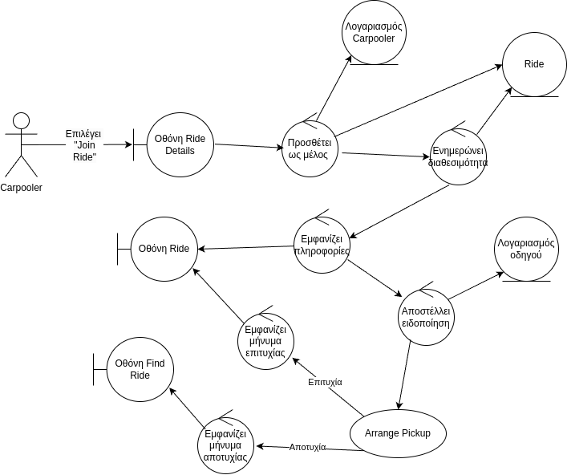

## Join Ride

### Περιγραφή

Ο χρήστης επιθυμεί 

#### Βασική Ροή

1. Ο χρήστης επιλέγει "Join Ride" στην οθόνη λεπτομεριών Ride.
2. Το σύστημα ενημερώνει τον κατάλληλο οδηγό για την αίτηση συμμετοχής του Carpooler - User.
3. Το σύστημα ενημερώνει την διαθεσιμότητα του Ride ανάλογα με το Passenger Limit.
4. Συνέχεια απο Βήμα 1. του UC Arrange Pickup.
5. Το σύστημα εμφανίζει ειδοποίηση επιτυχούς οργάνωσης Pickup και στους δύο ακροδέκτες.

#### Εναλλακτική Ροή: Αποτυχία οργάνωσης Pickup

5. Το σύστημα εμφανίζει ειδοποίηση αποτυχίας οργάνωσης Pickup και στους δύο ακροδέκτες.
6. Συνέχεια απο Βήμα 7 του UC Find Ride.

### Ανάλυση Ευρωστίας

